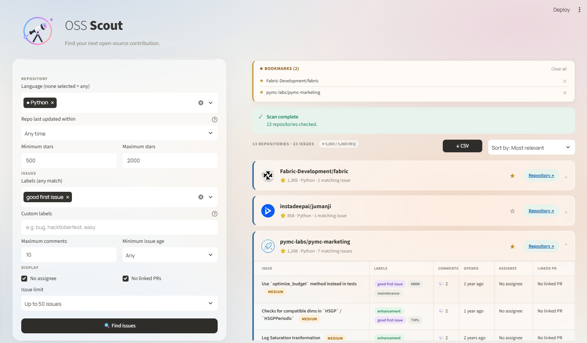
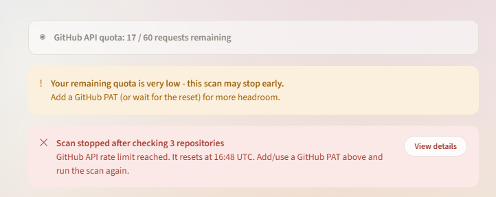
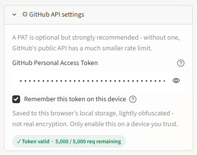

<div align="center">


# OSS Scout


*Search GitHub for open issues worth picking up — filtered by language, recency, and how much competition you're walking into.*

[**What it does**](#what-it-does) •
[**Filters**](#filters) •
[**Results**](#results) •
[**Setup**](#setup) •
[**GitHub token**](#github-token) •
[**MCP server**](#mcp-server) •
[**Security**](#security)

<br />

---



</div>

---

## What it does

Finding a good open-source issue to work on is harder than it sounds. You search GitHub, land on something that looks promising, then realise twelve people have already commented and someone opened a PR last week. You move on and repeat.

OSS Scout automates that sifting. You tell it what languages and labels you care about, set a star range to land on projects that are active but not enormous, and hit Find issues. It queries the GitHub Search API, checks each matching repository, and scores every issue by how contested it already is — based on its comment count, whether anyone's been assigned, and whether a linked pull request exists. The result is a ranked list of issues grouped by repo, with a LOW / MEDIUM / HIGH competition badge on each one so you can see at a glance where you actually have a shot.

---

## Filters

The left sidebar controls what gets searched.

**Repository filters** narrow down which repos are even considered. You can pick one or more languages (leaving it empty matches any), set a star range to focus on a specific tier of project size, and limit results to repos that have seen recent activity — useful for avoiding repos that are technically alive but haven't had a commit in two years.

**Issue filters** control what counts as a match within those repos. You can search by label presets like `good first issue` and `help wanted`, or type in any custom label — `hacktoberfest`, `easy`, `beginner`, whatever the project uses. The maximum comments filter keeps issues from showing up once they've already attracted a crowd. The "Opened within" filter restricts results to issues created in the last 7, 30, 60, or 90 days, so you're not looking at stale tickets nobody's touched. There are also checkboxes to exclude issues that already have an assignee or a linked pull request — the two clearest signs someone's already on it.

**Issue limit** caps how many results come back in total, from 10 up to 100.

> **Tip:** selecting 2–3 languages is the sweet spot. Each language runs as a separate API query (with a short pause between them to stay within GitHub's rate limits), so more languages means a longer search and a higher chance of hitting a secondary rate limit mid-way through.

---

## How search works

The search runs in two phases.

**Phase 1 — issue search:** OSS Scout queries GitHub's issue search API once per selected language, applying your label, age, comments, assignee, and linked-PR filters server-side. A short randomised pause (3–6 seconds) sits between each language query to stay within GitHub's secondary rate limits. A progress bar shows which language is currently being searched and how far along the run is.

**Phase 2 — repo verification:** every unique repository that appeared in Phase 1 is fetched individually to check its star count and last-activity date against your sidebar filters. A second progress bar shows which repo is being verified. Repos that don't pass are dropped; issues from repos that do pass are scored and ranked.

If GitHub's secondary rate limit is hit mid-search (even after the app retries with exponential backoff), OSS Scout shows whatever results it collected up to that point rather than discarding everything, along with a warning listing which languages were skipped.

---

## Results

Results are grouped by repository. Each repo card shows the project's avatar, star count, language, and how many matching issues were found. Clicking a card expands the issue table for that repo.

Each row in the table shows the issue title (linked directly to GitHub), its labels, comment count, how long ago it was opened, who's assigned (if anyone), and whether a linked pull request exists. The competition badge — LOW, MEDIUM, or HIGH — sits next to the title. Hovering over it explains what the score is based on.

At the top of the results area, the app shows how many repositories and issues were found and how many API requests were used out of your quota. You can sort by most relevant or most recently updated, and export everything to a CSV with one click.

**Bookmarks** let you save repos you want to come back to. The star icon on each repo card toggles it, and bookmarked repos appear in a panel at the top of the results. Bookmarks are stored in your browser's local storage, so they persist across sessions on the same device.

---

## Setup

```bash
git clone https://github.com/ajayraho/oss-scout.git
cd oss-scout
pip install -r requirements.txt
streamlit run app.py
```

The app opens at `http://localhost:8501`. It works without a token, but you will hit GitHub's unauthenticated rate limit (60 requests per hour) almost immediately on any real search. See [GitHub token](#github-token) below.

---

## GitHub token

With no token, GitHub allows 60 API requests per hour. A personal access token raises that to 5,000. For anything beyond a very small search, the token is effectively required.



**Creating one:** go to [github.com/settings/tokens](https://github.com/settings/tokens), choose *Fine-grained tokens*, and click *Generate new token*. OSS Scout only reads public data, so you can leave every permission at "No access" — no scopes needed at all. Generate the token and copy it.

Back in the app, open the **GitHub API settings** section in the sidebar, paste the token in, and it will validate immediately and show how many requests you have remaining.



The *Remember this token on this device* checkbox stores a lightly obfuscated copy locally so the field auto-fills on the next visit. Only enable it on a machine you trust and use alone.

**Handling rate limits gracefully.** When GitHub's secondary rate limit fires (a burst detector separate from the hourly quota), OSS Scout automatically retries with exponential backoff — waiting 2 s, 4 s, 8 s, 16 s, 32 s, and 64 s between attempts before giving up. That's up to ~126 seconds of internal retry before the user sees anything. If the limit persists, the app surfaces partial results from whichever languages already completed and shows a banner listing the ones that were skipped, so the run isn't wasted.

---

## MCP server

OSS Scout ships a built-in [MCP](https://modelcontextprotocol.io) server (`mcp_server.py`) that exposes the issue search as a tool any AI assistant can call directly — no browser needed.

**Tools exposed:**

| Tool | What it does |
|---|---|
| `find_oss_issues` | Search GitHub for beginner-friendly issues with full filter support |
| `check_github_rate_limit` | Check remaining API quota and reset time |

**Wiring it up to Claude desktop:**

1. Open (or create) `%APPDATA%\Claude\claude_desktop_config.json`
2. Add the following:

```json
{
  "mcpServers": {
    "oss-scout": {
      "command": "python",
      "args": ["C:\\path\\to\\oss-scout\\mcp_server.py"]
    }
  }
}
```

3. Restart Claude desktop.

The server automatically reads your saved token from the local cache — no extra config needed if you've already used the Streamlit app with *Remember this token* enabled.

Once connected, you can ask Claude things like:

> *"Find me good first issues in TypeScript repos opened in the last 30 days"*

and it calls the tool live and returns real results in the chat.

---

## Security

**Use a read-only token.** When creating your fine-grained PAT, grant it no permissions — not even read-only repository access is needed for public data. This means that if the token somehow leaks, there is nothing an attacker can do with it beyond making API requests against your rate limit.

**URL validation.** Every URL returned by the GitHub API is checked before it's rendered as a link. Anything that doesn't begin with `https://` or `http://` is silently dropped and replaced with `#`. Issue titles, repo names, labels, and assignee handles are all HTML-escaped before being written into the page.

**The token never leaves your machine** (when running locally). It goes only to `api.github.com` as a Bearer header and is never logged or sent anywhere else. The local cache file is obfuscated but not encrypted — treat it accordingly.

---

## Project structure

```
app.py           — Streamlit UI: sidebar filters, two-phase scan loop, progress bars, result cards, bookmarks, CSV export
github.py        — GitHub API client, per-language search with exponential backoff, competition score calculation
mcp_server.py    — MCP server: exposes find_oss_issues and check_github_rate_limit as AI tools
```

---

## License

MIT
